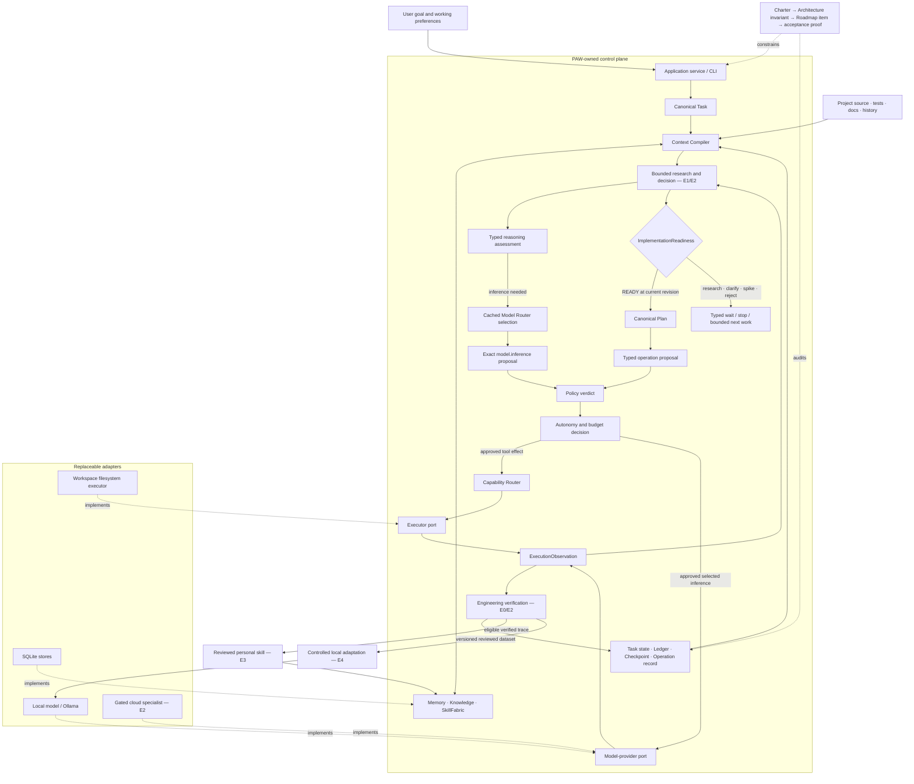

# PAW core architecture

This document defines the target contract for PAW Core. It is intentionally
stable and independent of the current file layout. See
`IMPLEMENTATION_MAP.md` for what the repository actually implements today.

## System boundary

PAW Core accepts a user goal and owns the state transitions that turn it into a
terminal task result. It may call replaceable providers and executors through
ports, but those adapters do not decide policy, task state or resume behavior.

```text
CLI / library caller
        |
        v
ChatService / application runtime -----------------------------+
        |                                                      |
        +--> Task + Task Graph                                 |
        +--> Context Compiler <--> Memory / Knowledge / Skills |
        +--> Research decision --> Implementation readiness    |
        +--> Operation Proposal                                |
        +--> Policy Gate --> Autonomy Gate                     |
        +--> Capability Router --> Executor port               |
        +--> Model Router ------> Model provider port          |
        +--> Observation --> Progress evaluation -------------+
        |
        +--> Ledger + checkpoint + operation records
```

SQLite is the default durable adapter. Ollama is one optional model-provider
adapter. Neither belongs to the domain model.

### Governed engineering-partner overview

This diagram is the canonical overview of module ownership and control flow.
It describes the target architecture; labels marked E0–E4 remain gated by the
Roadmap. A new adapter extends a port at the bottom and must not add a second
Task, Planner, Policy, Context, Router, Ledger or learning authority.



The enforceable trace for each change is:

```text
Roadmap item -> Task -> Plan -> current decision -> exact proposal
             -> Policy/Autonomy -> operation record -> verification record
             -> eligible memory/skill/dataset use
```

Missing or stale links stop the transition; a diagram or checklist label is
never evidence by itself.

## Engineering reasoning boundary

PAW is optimized for code, systems and software architecture. Project
understanding is a derived, versioned view over workspace sources, dependency
relationships, tests, task history, decisions and verified artifacts. It is
not a second task store or an unbounded prompt, and it does not create a new
owner beside Memory, Knowledge and Context Compiler.

The target reasoning flow is:

```text
Technical goal
      |
      v
Local project understanding -----> Memory / Knowledge / repository evidence
      |
      v
Context manifest (sources, hashes, budget, privacy, selection reasons)
      |
      v
Bounded research ------> options, contrary evidence and assumptions
      |                  via narrow local support or gated cloud reasoning
      v
Implementation readiness: READY / CLARIFY / RESEARCH / SPIKE / REJECT
      |
      v
Canonical Plan and ProposedAction only when READY
      |
      v
Policy -> execution -> verification -> verified trace and curated memory
```

The roles are deliberately asymmetric:

| Role | Local responsibility | Cloud responsibility |
|---|---|---|
| Control | Task state, policy, approvals, budgets, routing evidence and resume | None; cloud output is advisory until PAW gates it. |
| Project understanding | Indexing, retrieval, dependency/symbol maps, diff and test summaries | Analyze only the selected evidence needed for the hard decision. |
| Reasoning | Deterministic analysis and evaluated narrow inference such as classification, ranking and compression | Novel debugging, architecture trade-offs, cross-module planning, difficult review and synthesis. |
| Execution | Workspace tools and replaceable executors behind Policy | No direct execution authority. |
| Learning | Provenance, scoped memory, verified traces and dataset curation | Optional teacher output; never the owner of learned state. |

A local model is an optional replaceable adapter, not the definition of
local-first. PAW may escalate when novelty, uncertainty, impact or required
reasoning depth exceeds an evaluated local capability. It may stay local when
privacy, cost, latency or a proven narrow capability favors local processing.
Saving tokens is subordinate to retaining the evidence needed for a correct
answer.

In this post-gate target, every local or cloud inference is a typed
`model.inference` operation. Its context manifest, privacy class, estimated
budget, selected role and escalation reason are recorded before invocation. A
model response may create a proposed action, but it cannot authorize or execute
that action.

### Pre-implementation research contract

This is a post-Core-Stabilization target, not a claim about the current runtime.
It adds a decision gate to the canonical loop; it does not add a second planner,
runtime, store or knowledge system.

Every engineering goal is assigned one bounded research depth before production
implementation:

- `FAST` for small, reversible, low-uncertainty work whose owner and current
  behavior are already established;
- `STANDARD` for normal cross-file changes, bugs and design choices that need
  reproduction, local evidence and comparison of alternatives;
- `DEEP` for architectural, novel, high-impact, hard-to-reverse or externally
  constrained decisions that need authoritative prior art or an isolated spike.

Research starts with project evidence: source, tests, contracts, dependency
relationships, history and verified artifacts. External sources are added only
when local evidence cannot answer the decision or prior art materially changes
it. External content is untrusted input and must pass admission, provenance,
privacy and prompt-injection controls before entering model context.

The resulting decision artifact records at least:

- task and project revision, problem, goals, non-goals and hard constraints;
- current behavior or reproduced root cause;
- evidence references with provenance, status, confidence and freshness;
- considered options, including the smallest viable option and, for
  `STANDARD`/`DEEP`, an explicit do-nothing or defer option;
- selected and rejected reasons, contrary evidence and unresolved assumptions;
- risks, rollback or containment, acceptance checks and verification level;
- research budget, stop condition and one typed readiness outcome.

`ImplementationReadiness` is distinct from Policy decisions, Autonomy decisions,
task status and stop reasons. Its values are:

```text
NEEDS_RESEARCH | NEEDS_CLARIFICATION | SPIKE_REQUIRED | READY | REJECTED
```

An implementation-purpose `Plan` or mutating `ProposedAction` requires a durable
`READY` decision artifact for the same task and project revision. A research-only
plan may use the existing Planner, but it is marked as research-only and excludes
production effects. A spike is isolated, disposable and verified separately; its
output returns to the decision gate and cannot silently become production code.

Research is sufficient when the hard constraints are supported, the leading
option can be distinguished from alternatives, important contrary evidence has
been addressed and the acceptance checks can falsify the decision. The runtime
then stops research at the recorded evidence/time/token budget instead of seeking
unbounded certainty. Research operations, including model and network calls,
still use the canonical runtime and pass Policy before their effects.

### Recorded architecture decision: extend the canonical spine

Decision date: 2026-09-01. Three options were considered:

1. add a `ResearchTask`, research runtime, verifier manager and skill registry;
2. leave the post-gate flow conceptual until each feature is implemented;
3. extend the existing Task, Planner, runtime, evidence and Skill Fabric
   contracts with typed purpose, decision and verification records.

Option 3 is selected. Option 1 duplicates ownership and creates another loop.
Option 2 defers boundary decisions until schema and callers make them expensive
to change. The contracts below are ratified targets, not current source claims.

### Work identity and decision lifecycle

There is one canonical `Task` from intake through learning. Research does not
create a parallel task model. A `Plan` has a distinct plan identifier but must
reference an already durable `Task.id`; Planner never invents or replaces task
identity. Project-bound work also records the exact project revision and a hard-
constraint fingerprint used by the decision.

Every Plan has one `PlanPurpose`:

```text
RESEARCH | SPIKE | IMPLEMENTATION
```

- `RESEARCH` may read project evidence and perform gated model/network
  operations, but cannot mutate production project state.
- `SPIKE` may mutate only an explicitly isolated, disposable workspace. Its
  output is evidence, not implementation.
- `IMPLEMENTATION` may propose project mutation only when it references a
  current `READY` decision for the same Task, project revision and constraint
  fingerprint.

A versioned decision artifact has one record state:

```text
DRAFT | FINAL | STALE | SUPERSEDED
```

`ImplementationReadiness` is the outcome of a `FINAL` artifact, not its record
state. Final artifacts are immutable. New evidence creates a new version and
supersedes the old one. A relevant source revision, hard constraint or accepted
user clarification change makes the old artifact `STALE`; stale readiness cannot
authorize a Plan. The application runtime evaluates sufficiency and coordinates
the transition, while Knowledge/Evidence owns claims and centralized persistence
owns storage/migration. User approval may resolve a choice, but cannot convert a
missing safety constraint or failed verification into `READY`.

### Verification model and verified traces

PAW uses “verification” at three non-interchangeable layers:

1. **Operation observation:** `ExecutionObservation` records whether one
   executor invocation returned successfully and what it changed. It does not
   prove the engineering goal is correct.
2. **Engineering verification:** a predeclared `VerificationSpec` describes a
   falsifiable acceptance check. A `VerificationRecord` links its exact Task,
   project revision, operation/executor, observed command or check, result,
   artifacts and provenance. Verification operations use the canonical runtime
   and Policy like every other effect.
3. **Benchmark/gate evaluation:** the E0 runner or release process compares a
   complete trace with human-reviewed fixtures and acceptance thresholds. It is
   an evaluator of runtime output, not another execution authority.

A `VerificationSpec` minimally records spec ID/version, Task and project
revision, check kind, required/optional flag, preconditions, expected outcome,
capability/privacy requirements, timeout and evidence/artifact expectations. A
`VerificationRecord` references that spec and the exact operation, records
`PASS`, `FAIL`, `ERROR` or `SKIPPED`, observed output/artifacts, verifier identity,
timestamps and provenance. Only `PASS` satisfies a required spec; `SKIPPED` is
never silently successful.

A successful verified trace is eligible for skill/dataset use only when:

- the Task and relevant project revision are exact and current;
- every required operation record and terminal transition committed;
- every required `VerificationRecord` passed against its declared spec;
- required evidence/citations are valid and no Policy violation occurred;
- no approval, prepared external effect, ambiguity or blocking assumption is
  unresolved; and
- benchmark/human review required by the consuming lifecycle has passed.

Failed or partial traces remain valuable diagnostic evidence but are not
positive training labels and cannot promote a personal skill. E0 fixtures and
expected evidence are reviewed independently of the system under evaluation,
so benchmark construction does not depend on E1–E3 capabilities.

### Escalation protocol

Escalation changes the reasoning route; it does not merge model routing with
executor routing. The target protocol is:

1. an observation supplies a typed reasoning assessment containing confidence,
   applicability, missing evidence and out-of-distribution signals;
2. the application runtime evaluates recorded role thresholds and impact rules;
3. Model Router selects the next eligible model/provider for the same cognitive
   role or a named stronger role using only already admitted local/cached
   manifests; it does not select an executor, perform discovery I/O or authorize
   a call;
4. the runtime creates the next `model.inference` proposal with the selected
   route, privacy disclosure and estimated cost;
5. Policy evaluates that exact proposal once, then Autonomy consumes the verdict
   and returns `ESCALATE` only when another attempt fits the remaining
   decision/model/time budget;
6. only then may the runtime invoke the provider; and
7. the ledger links the assessment, escalation reason, prior route, next route,
   verdict, autonomy decision and outcome.

`ESCALATE` is a non-terminal control transition in this target. No eligible
route, denied disclosure, exhausted budget or unavailable required cloud route
produces an explicit typed stop; it never silently downgrades. Provider discovery
or health work that performs network I/O is itself a gated operation, not hidden
inside route selection. Capability Router continues to select executors only.

### Governed skill lifecycle

`SkillFabric` remains the sole skill registry and lifecycle owner. The existing
skill manifest is extended rather than wrapped by a second registry. Each exact
skill version has immutable content/provenance and one lifecycle state:

```text
CANDIDATE | REVIEWED | ACTIVE | REJECTED | DEPRECATED | SUPERSEDED
```

Only `ACTIVE` versions participate in normal selection. Candidate creation
requires an explicit request or eligible verified trace; review requires replay
evidence; activation requires approval of the exact version. Rejection,
deprecation, supersession and rollback are durable ledgered transitions. An
`enabled` flag alone is not evidence that a skill is reviewed or trusted, and
the existing `skill_registry` persistence table may not become a second owner.
The normal transition path is `CANDIDATE -> REVIEWED -> ACTIVE`;
`CANDIDATE`/`REVIEWED` may become `REJECTED`, while `ACTIVE` may become
`DEPRECATED` or `SUPERSEDED`. Rollback selects an exact previously reviewed
version through a new audited transition; it never rewrites version history.

### Tenancy boundary

Through BETA, PAW assumes one local user authority over its configured
workspaces. `project_id`, `session_id` and `task_id` are scope identifiers, not
security tenants; `Identity` stores preferences, not authentication. The runtime
does not claim isolation between mutually untrusted users sharing one database
or process. Multi-user/hosted operation requires a separate threat model,
authorization contract, tenant-keyed persistence migration and acceptance gate.

## Dependency direction

The conceptual layers are:

1. **Domain contracts** — identifiers, task and graph state, capabilities,
   policy/autonomy decisions, proposals, observations and results. They contain
   no database, CLI, provider or executor implementation.
2. **Core services** — planning, skill selection, context compilation, policy,
   autonomy, routing and progress evaluation. They depend on domain contracts
   and declared ports.
3. **Application runtime** — the only owner of the execution state machine and
   transaction ordering. It composes core services; services do not start a
   competing loop.
4. **Ports and adapters** — stores, SQLite, model providers, executors and CLI.
   Adapters depend inward on PAW contracts; Core never depends on an adapter's
   private types.

Moving files is not required to respect these layers. Import and ownership
direction matter more than directory shape.

## Canonical runtime contract

There is one logical loop for single tasks and graph nodes. A graph changes how
the next ready unit is selected; it does not create another safety or execution
pipeline.

The current implementation materializes that contract as
`PawRuntime._execute_unit`. Public modes may own proposal/context iteration or
graph dependency transitions, but Policy, Autonomy, execution, observation,
operation recording and approval consumption have this one owner. A structural
regression test rejects a second gate path.

```text
1. Load or create durable Task state
2. Select ready TaskNode (or the task itself)
3. Discover skills and compile budgeted context
4. Propose the next operation
5. Authorize the proposal through Policy
6. Decide through Autonomy whether work may continue
7. Select executor through CapabilityRouter
8. Select a model through ModelRouter only when the operation needs one
9. Prepare a durable effect intent when the executor changes external state
10. Execute once, or reconcile a previously prepared effect, with an idempotency key
11. Persist observation and operation completion atomically
12. Evaluate progress, dependency effects and terminal state
13. Persist checkpoint and ledger events
14. CONTINUE, REPLAN, WAIT, ESCALATE or STOP
```

If step 4 requires a model/provider call, that call is itself a proposed
operation and must pass policy, privacy and budget checks before network or
billable work occurs. “Planning” is not an exemption from the side-effect gate.

The runtime may internally optimize reads, but it may not reorder authorization
after execution or acknowledge durable progress before commit.

## Operation envelope

Every executable unit, including a model call, has one typed proposal carrying:

- stable operation and task/node identifiers;
- operation kind and explicit intent;
- required action capabilities;
- input/context references rather than hidden global state;
- estimated resource use and privacy requirements;
- selected skill, model role and executor constraints when applicable;
- an idempotency key stable across retry and resume.

Execution returns one typed observation carrying success/failure, result,
artifacts, resource usage, retryability, progress signal and a typed error.
Arbitrary dictionaries may exist at adapter boundaries but must be normalized
before entering runtime state.

## Decision ownership

| Decision | Sole owner | Notes |
|---|---|---|
| Is the action permitted? | Policy Engine | `ASK` is a wait state, never implicit permission. |
| Should the loop continue? | Autonomy Controller | Uses budget, progress, repetition, stall and terminal state. |
| Which executor can perform it? | Capability Router | Matches action capabilities, risk, privacy, cost and availability. |
| Which model should reason? | Model Router | Matches cognitive role and provider constraints; does not select executors. |
| What context is sent? | Context Compiler | Enforces budget, selection reason and provenance. |
| Which skills are relevant? | `AdvancedSkillSelector` | Owns lexical/semantic ranking; legacy selectors only adapt result shapes and never authorize execution. |
| Which skill version may be active? | `SkillFabric` | Owns reviewed lifecycle transitions; selection considers only `ACTIVE` versions. |
| Is implementation ready? | Application runtime using `ImplementationReadiness` | Consumes the source-backed decision artifact; does not replace Policy, Autonomy or task state. |
| Did an acceptance check pass? | Application runtime applying `VerificationSpec` | Converts exact observations into `VerificationRecord`; executor success alone is insufficient. |
| Does reasoning require a stronger route? | Application runtime applying recorded role thresholds | Produces the escalation transition; Autonomy limits another attempt and Model Router selects it. |
| How is a goal decomposed? | Planner | Creates and persists canonical `Plan`/`TaskNode` records; decomposition helpers are pure strategies. |
| What operation is attempted next? | Runtime proposer | Creates `ProposedAction` only; it does not persist plans or advance DAG state. |
| What runs next in a DAG? | Task Scheduler | Honors dependency and failure propagation rules. |
| What happened? | Task Ledger | Append-oriented audit record; not long-term memory. |
| What resumes? | Checkpoint/operation store | Durable runtime state plus completed idempotency keys. |

A service may request another owner's decision, but it may not duplicate the
decision logic.

`SkillSelector` and `SemanticSkillSelector` remain compatibility facades for
older library callers. They delegate ranking to `AdvancedSkillSelector`; Policy
still evaluates only the exact runtime proposal. These facades may be removed
only in a major compatibility release after repository and documented callers
have migrated to the canonical selector result.

## Task and runtime state

The domain needs one canonical task status model. At minimum it distinguishes:

```text
PENDING -> RUNNING -> COMPLETED
                  \-> FAILED
                  \-> PARTIAL
                  \-> BLOCKED
                  \-> WAITING_APPROVAL
                  \-> PAUSED / CHECKPOINTED -> RESUMING -> RUNNING
                  \-> CANCELLED
```

Autonomy decisions are not task statuses. A decision such as `WAIT`, `REPLAN`
or `STOP` produces an explicit state transition and typed stop reason.

For graphs:

- a node becomes ready only when all required predecessors completed;
- a failed required predecessor blocks its dependents;
- optional dependencies are explicit;
- cycles and missing dependencies are rejected before persistence/execution;
- a graph cannot be marked successful while a required node failed or never
  ran;
- resume restores node states and operation keys, not only graph order.

## Safety invariants

These are constitutional. Violating one makes the affected gate `FAIL` even if
the test suite is otherwise green.

1. **Single contract:** one canonical type and implementation per owned
   concept. Compatibility aliases have an owner and removal date/condition.
2. **Policy before effects:** filesystem writes, processes, network/model
   calls, financial actions and destructive work cannot occur before Policy.
3. **ASK waits:** ASK creates a durable approval request. Only a matching,
   recorded approval may resume the exact proposal.
4. **Bounded autonomy:** hard iteration/resource bounds and typed stop reasons
   apply to every runtime path.
5. **Independent routing:** capability and model routing never substitute for
   each other.
6. **Durable acknowledgement:** a successful operation is not reported until
   its observation and operation record commit.
7. **Idempotent resume:** retries and resumes reuse the operation key and do not
   repeat a completed side effect.
8. **Failure propagation:** required DAG failures block dependents and prevent
   false task completion.
9. **Explainable context:** every included fragment has provenance, score and
   reason; every budget limit is enforced on the final payload.
10. **Adapter isolation:** no external provider type leaks into domain models or
    owns PAW state.
11. **Observable decisions:** proposal, policy, autonomy, selection, execution,
    observation and terminal transition are reconstructable from the ledger.
12. **No destructive initialization:** normal initialization/migration never
    drops user tables or data.
13. **Immutable approval input:** runtime-owned resume state never mutates the
    `ProposedAction` whose fingerprint was approved.
14. **Workspace containment:** a local filesystem adapter resolves every target
    against its configured workspace and independently rejects traversal or
    symlink writes even after approval.

### Post-gate reasoning invariants

The following constraints are ratified for E1–E4 in the Roadmap. They do not
claim current implementation and do not retroactively change the S0–S6 exit
gate; each becomes an acceptance invariant when its named track starts:

- **Minimum cloud disclosure:** a remote inference receives only an approved,
  budgeted context manifest with provenance; PAW never sends an implicit full
  workspace or raw activity history.
- **Traceable learning:** recalled memory and training examples retain source,
  scope and lifecycle metadata; model output alone is not durable fact.
- **Governed skill promotion:** a verified trace may create a candidate skill,
  but only reviewed replay evidence, explicit acceptance and a reversible
  version transition may make it active.
- **Quality-preserving optimization:** local routing, compression or training
  cannot be accepted solely for lower token use when verified engineering
  quality or safety regresses.
- **Evidence before implementation:** an implementation-purpose Plan or mutating
  proposal must reference a `READY` decision for the same project revision;
  `NEEDS_RESEARCH`, `NEEDS_CLARIFICATION`, `SPIKE_REQUIRED` and `REJECTED` cannot
  be coerced into execution.
- **One work identity:** research, spike, implementation, verification and
  learning preserve the same canonical Task identity; Plan identity never
  substitutes for `Task.id`.
- **Observation is not verification:** executor success cannot create a verified
  trace without passing every predeclared engineering verification check.
- **Split escalation authority:** runtime detects the need, Model Router selects
  locally, Policy evaluates the exact inference proposal and Autonomy consumes
  that verdict plus budget before invocation; no component inherits another
  owner's decision.
- **Honest tenancy:** through BETA, PAW is single-user and local-authority only;
  project/session identifiers must not be represented as tenant isolation.

## Persistence contract

Schema ownership is centralized. Feature modules may define repositories or
store interfaces, but must not create or drop tables on demand.

Required properties:

- an explicit schema version and ordered, idempotent migrations;
- all writes use explicit transaction boundaries;
- a store method does not claim durability before commit;
- checkpoints contain task/node state, autonomy usage, detector state, context
  references and completed operation keys needed for a faithful resume;
- ledger and operation completion are committed with the state transition they
  describe, or recovery rules explain the split;
- process-restart tests close and reopen SQLite instead of reading through the
  same connection.

The implemented local transaction boundaries are:

- `STEP_EXECUTED`, result-owned `ARTIFACT_CREATED` / `EXECUTION_COMPLETED`,
  `OperationRecord`, `OPERATION_RECORDED` and `STEP_COMPLETED` commit or roll
  back together;
- a checkpoint and `CHECKPOINT_CREATED` commit together;
- for terminal transitions, checkpoint, task status and `TASK_COMPLETED`
  commit or roll back together.

An executor's external side effect cannot share a SQLite transaction. It must
receive the stable operation key and either be idempotent or provide a
reconciliation rule. For an executor that declares an effect, the runtime first
commits an `EffectIntent` and a `prepared` operation record. If that commit
fails, the executor is not called. If execution occurs but local completion is
interrupted, restart calls `reconcile_effect()` instead of calling `execute()`
again.

The built-in filesystem executor reconciles the stable operation/idempotency
key, workspace-relative path, write mode and intended content hash. Matching
final content is accepted as applied; an absent, changed or mismatched target is
reported as ambiguous and is not overwritten. The current crash-window proof
is specific to this adapter. Every future executor with an external effect must
implement and test its own intent and reconciliation semantics; PAW never treats
an absent completion record as proof that an arbitrary effect did not occur.

## Context, memory and knowledge

- **Context** is the bounded payload for the current decision.
- **Memory** stores user/project facts and prior experience worth recalling.
- **Knowledge** stores sources, chunks, evidence and citations.
- **Ledger** stores what PAW did.
- **Skills** store how a capability should be applied.

These stores may contribute candidates to `ContextCompiler`; they do not append
their full contents directly to a model prompt. Retrieval and final payload
budgeting are separate steps, and final skill-body upgrades must be re-budgeted.

User adaptation has four distinct layers and must not collapse them:

1. **Activity evidence:** task, ledger, observation and artifact records state
   what occurred. They are audit input, not training labels.
2. **Curated memory:** explicit preferences, project decisions and verified
   facts are stored with source, scope, confidence, retention and correction
   semantics.
3. **Context adaptation:** retrieval and compression use those records to avoid
   resending irrelevant history while preserving required evidence.
4. **Model adaptation:** distillation or fine-tuning is an offline, reversible
   release process over a versioned and redacted dataset of verified examples.

There is no continuous online training from raw conversations, keystrokes,
workspace contents or failed attempts. Before a trained local artifact can be
selected, its narrow role, base model, dataset provenance, evaluation result,
version and rollback target must be known. Deleting or correcting source memory
must have an explicit consequence for future dataset builds.

Persisted knowledge records and result contracts have different ownership and
are joined only by `paw.knowledge.normalize_knowledge_result`:

| Persisted knowledge | Result contract |
|---|---|
| `KnowledgeEvidence.id/chunk_id` | `Evidence.evidence_id/chunk_id` |
| `KnowledgeChunk.source_id` | `Evidence.source` and `Citation.source_id` |
| `KnowledgeEvidence.claim/confidence` | `Evidence.claim/confidence` |
| `KnowledgeCitation.id/evidence_id` | `Citation.citation_id/evidence_id` |

The normalizer rejects missing chunks, foreign-task citations, unknown evidence
references and duplicate IDs. It does not silently manufacture provenance.

## Extension ports

The stable extension boundaries are:

- `ModelProvider`: discover/health/complete/embed/stream as supported;
- `Executor`: declare action capabilities, execute an approved proposal and,
  for external effects, prepare/reconcile a durable effect intent;
- `SkillProvider`: discover and import normalized skill manifests;
- memory/knowledge repositories: retrieve and persist PAW-owned records.

The first real built-in adapter is `LocalFilesystemExecutor`. It implements the
existing Executor port and is composed by `ChatService`; Core does not import or
register it globally. Structured filesystem actions explicitly opt out of model
inference, so Capability Router and Model Router remain independent.

Adding an adapter must not require a new PAW task, policy, context or checkpoint
type. If it does, the port is incomplete or the adapter is leaking inward.

## Public application surface

The intended public surface is small:

- create/load a session and task;
- run or resume through the canonical runtime;
- inspect task state, ledger, checkpoint and approval requests;
- inspect Plan purpose, decision version/readiness, verification records and
  escalation history when their post-gate tracks are implemented;
- configure policies, skills, providers and execution profiles through typed
  PAW contracts.

The first source-backed application surface is
`paw.application.chat.ChatService`, exposed by `paw chat`. It stores the
transcript as an application projection while Session, Task, Policy, Approval,
Ledger and Checkpoint remain core-owned records.

The CLI exposes bounded projections through `/plan`, `/why`, `/ledger`,
`/checkpoint`, `/policy`, `/skills` and `/artifacts`; these commands inspect
durable PAW state and do not start another runtime path.

Module-level helper proliferation and broad wildcard exports are not part of
the architectural contract. `paw.core` exports only the small runtime contract:
the canonical decision/status/capability/proposal/observation/result types plus
`PawRuntime` and `RuntimeOutcome`. Services such as `Planner`, `TaskScheduler`
and stores are imported from their owning modules.
