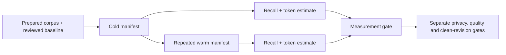

# E1-27 Context measurement gate

Current contract, 2026-09-07.
Owner: `paw.bench.integration.run_integration_pack`.

This is a measurement-only gate, not full E1 acceptance. A PASS does not certify
engineering verification, privacy safety, actual cloud savings or revision freeze.

For each unique YAML case, require an explicit positive baseline and a
caller-prepared corpus. Compile cold then warm with the same configured compiler.
Each compilation yields one manifest shared by recall and token scoring.
case_count counts cases, not samples. Duplicate IDs and invalid measurements
raise errors; compilation errors are not converted to successful evidence.

- No cases: BLOCKED.
- Any sample recall below 0.5: FAIL.
- Otherwise any sample recall below 0.95: PARTIAL.
- Otherwise median warm token reduction below 0.30: PARTIAL.
- Otherwise: PASS for this measurement gate only.
- Negative per-case reductions remain visible in the report.
- Failed runs raise; callers must not reuse an older report as current evidence.

E1 overall remains PARTIAL until reviewed, revision-bound corpus/baseline
measurements and the remaining acceptance evidence exist. Synthetic compiler
tests prove gate logic, not real-world savings. Cold/warm labels alone do not
prove cache isolation or useful cache hits.
