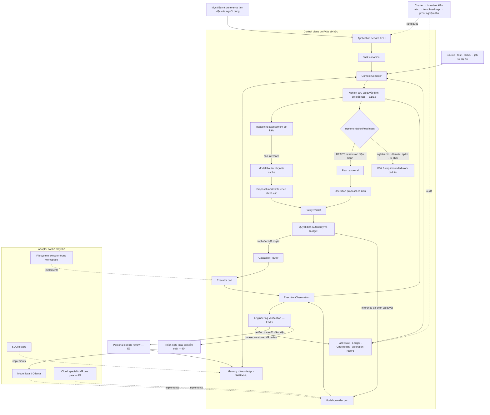

# Kiến trúc lõi PAW

Tài liệu này định nghĩa contract đích của PAW Core. Nó ổn định và độc lập với
cách sắp xếp file hiện tại; xem [bản đồ triển khai](IMPLEMENTATION_MAP.md) để
biết mã nguồn thực tế đang làm được gì.

## Ranh giới hệ thống

PAW Core nhận mục tiêu người dùng và sở hữu mọi chuyển trạng thái dẫn đến kết
quả cuối của task. PAW có thể gọi provider/executor thay thế được qua port,
nhưng adapter không quyết định policy, task state hoặc resume.

```text
CLI / library caller
        |
        v
ChatService / application runtime -----------------------------+
        |                                                      |
        +--> Task + Task Graph                                 |
        +--> Context Compiler <--> Memory / Knowledge / Skills |
        +--> Quyết định nghiên cứu --> Mức sẵn sàng triển khai |
        +--> Operation Proposal                                |
        +--> Policy Gate --> Autonomy Gate                     |
        +--> Capability Router --> Executor port               |
        +--> Model Router ------> Model provider port           |
        +--> Observation --> Progress evaluation -------------+
        |
        +--> Ledger + checkpoint + operation records
```

SQLite là adapter lưu bền vững mặc định. Ollama là một model-provider adapter
tùy chọn. Không adapter nào thuộc domain model.

### Overview engineering partner có quản trị

Đây là sơ đồ canonical về ownership module và luồng kiểm soát. Sơ đồ mô tả
kiến trúc đích; các nhãn E0–E4 vẫn bị khóa theo Roadmap. Adapter mới chỉ mở
rộng port phía dưới, không được tạo Task, Planner, Policy, Context, Router,
Ledger hoặc learning authority thứ hai.



Trace bắt buộc có thể kiểm tra cho mỗi thay đổi:

```text
Item Roadmap -> Task -> Plan -> decision hiện hành -> proposal chính xác
             -> Policy/Autonomy -> operation record -> verification record
             -> memory/skill/dataset đủ điều kiện
```

Link thiếu hoặc stale sẽ chặn transition; sơ đồ hoặc nhãn checklist tự nó
không phải bằng chứng.

## Boundary suy luận kỹ thuật

PAW được tối ưu cho code, hệ thống và kiến trúc phần mềm. Hiểu biết về dự án là
một góc nhìn dẫn xuất, có version trên source trong workspace, quan hệ dependency,
test, lịch sử task, quyết định và artifact đã kiểm chứng. Nó không phải task
store thứ hai hoặc prompt không giới hạn, và không tạo owner mới bên cạnh
Memory, Knowledge và Context Compiler.

Luồng suy luận đích:

```text
Mục tiêu kỹ thuật
      |
      v
Hiểu dự án ở local ----------> Memory / Knowledge / bằng chứng repository
      |
      v
Context manifest (source, hash, budget, privacy, lý do chọn)
      |
      v
Nghiên cứu có giới hạn -> phương án, bằng chứng ngược và giả định
      |                  qua hỗ trợ local hẹp hoặc cloud đã qua gate
      v
Mức sẵn sàng: READY / CLARIFY / RESEARCH / SPIKE / REJECT
      |
      v
Chỉ tạo Plan canonical và ProposedAction khi READY
      |
      v
Policy -> execution -> verification -> trace đã kiểm chứng và memory chọn lọc
```

Các vai trò cố ý không đối xứng:

| Vai trò | Trách nhiệm local | Trách nhiệm cloud |
|---|---|---|
| Control | Task state, policy, approval, budget, bằng chứng routing và resume | Không có; output cloud chỉ là tư vấn cho tới khi PAW gate. |
| Hiểu dự án | Index, retrieval, dependency/symbol map, tóm tắt diff và test | Chỉ phân tích bằng chứng đã chọn cần cho quyết định khó. |
| Suy luận | Phân tích xác định và inference hẹp đã đánh giá như classification, ranking, compression | Debug mới, trade-off kiến trúc, kế hoạch xuyên module, review khó và tổng hợp. |
| Thực thi | Tool workspace và executor thay thế được phía sau Policy | Không có quyền thực thi trực tiếp. |
| Học | Provenance, memory đúng scope, trace đã kiểm chứng và quản lý dataset | Có thể là teacher output; không sở hữu learned state. |

Model local là adapter tùy chọn có thể thay thế, không phải định nghĩa của
local-first. PAW có thể chuyển lên cloud khi độ mới, bất định, tác động hoặc độ
sâu suy luận vượt năng lực local đã được đánh giá. PAW có thể giữ ở local khi
privacy, chi phí, latency hoặc capability hẹp đã được chứng minh phù hợp hơn.
Tiết kiệm token phải đứng sau việc giữ đủ bằng chứng để trả lời đúng.

Trong đích sau gate này, mọi inference local hoặc cloud đều là operation
`model.inference` có kiểu. Context manifest, privacy class, budget ước tính,
role đã chọn và lý do escalation được ghi trước invocation. Model response có
thể tạo proposed action nhưng không thể authorize hoặc tự chạy action đó.

### Contract nghiên cứu trước triển khai

Đây là đích sau Core Stabilization, không phải claim về runtime hiện tại. Nó
thêm một decision gate vào loop canonical; không tạo planner, runtime, store
hoặc hệ knowledge thứ hai.

Mỗi mục tiêu kỹ thuật được gán một độ sâu nghiên cứu có giới hạn trước khi sửa
production:

- `FAST` cho thay đổi nhỏ, dễ đảo ngược, ít bất định khi owner và hành vi hiện
  tại đã rõ;
- `STANDARD` cho bug, thay đổi nhiều file và lựa chọn thiết kế thông thường cần
  tái hiện, bằng chứng local và so sánh phương án;
- `DEEP` cho quyết định kiến trúc, mới, tác động cao, khó đảo ngược hoặc bị ràng
  buộc bên ngoài, cần prior art có thẩm quyền hoặc spike cô lập.

Nghiên cứu bắt đầu từ bằng chứng dự án: source, test, contract, quan hệ
dependency, lịch sử và artifact đã kiểm chứng. Chỉ thêm nguồn ngoài khi bằng
chứng local không trả lời được quyết định hoặc prior art có thể thay đổi đáng kể
lựa chọn. Nội dung ngoài là input không tin cậy và phải qua admission,
provenance, privacy cùng kiểm soát prompt injection trước khi vào model context.

Decision artifact kết quả ghi tối thiểu:

- task và revision dự án, vấn đề, goal, non-goal cùng hard constraint;
- hành vi hiện tại hoặc root cause đã tái hiện;
- tham chiếu bằng chứng có provenance, trạng thái, confidence và freshness;
- các phương án đã xét, gồm phương án khả thi nhỏ nhất và, với
  `STANDARD`/`DEEP`, phương án không làm hoặc hoãn;
- lý do chọn/bỏ, bằng chứng ngược và giả định chưa giải quyết;
- risk, rollback hoặc containment, acceptance check và mức verification;
- budget nghiên cứu, điều kiện dừng và một readiness outcome có kiểu.

`ImplementationReadiness` khác Policy decision, Autonomy decision, task status
và stop reason. Các giá trị là:

```text
NEEDS_RESEARCH | NEEDS_CLARIFICATION | SPIKE_REQUIRED | READY | REJECTED
```

`Plan` nhằm triển khai hoặc `ProposedAction` gây thay đổi phải có decision
artifact `READY` bền vững cho đúng task và revision dự án. Plan chỉ để nghiên
cứu có thể dùng Planner hiện tại, nhưng phải được đánh dấu research-only và loại
production effect. Spike phải cô lập, có thể bỏ và được kiểm chứng riêng; output
quay lại decision gate, không được âm thầm trở thành code production.

Nghiên cứu là đủ khi hard constraint có bằng chứng, có thể phân biệt phương án
dẫn đầu với phương án khác, bằng chứng ngược quan trọng đã được xử lý và
acceptance check có thể bác bỏ quyết định. Runtime dừng ở budget bằng chứng,
thời gian và token đã ghi thay vì tìm sự chắc chắn vô hạn. Operation nghiên cứu,
kể cả model/network call, vẫn dùng runtime canonical và qua Policy trước effect.

### Quyết định kiến trúc: mở rộng spine canonical

Ngày quyết định: 2026-09-01. Ba phương án đã được xét:

1. thêm `ResearchTask`, research runtime, verifier manager và skill registry;
2. giữ flow hậu gate ở mức khái niệm cho tới khi triển khai từng feature;
3. mở rộng contract Task, Planner, runtime, evidence và Skill Fabric hiện có
   bằng purpose, decision và verification record có kiểu.

Chọn phương án 3. Phương án 1 sao chép ownership và tạo loop thứ hai. Phương án
2 hoãn quyết định boundary tới khi schema/caller làm việc đổi hướng trở nên đắt.
Các contract dưới đây là đích đã phê duyệt, không phải claim source hiện tại.

### Identity công việc và lifecycle quyết định

Chỉ có một `Task` canonical từ intake tới learning. Research không tạo task
model song song. `Plan` có plan identifier riêng nhưng phải tham chiếu `Task.id`
đã lưu bền vững; Planner không tự phát minh hoặc thay task identity. Công việc
gắn project cũng ghi chính xác project revision và fingerprint hard constraint
được decision sử dụng.

Mỗi Plan có một `PlanPurpose`:

```text
RESEARCH | SPIKE | IMPLEMENTATION
```

- `RESEARCH` được đọc project evidence và chạy model/network operation đã gate,
  nhưng không mutate trạng thái project production.
- `SPIKE` chỉ được mutate workspace cô lập, có thể bỏ được khai báo tường minh;
  output là evidence, không phải implementation.
- `IMPLEMENTATION` chỉ được propose mutation dự án khi tham chiếu decision
  `READY` hiện hành cho cùng Task, project revision và constraint fingerprint.

Decision artifact có version và một record state:

```text
DRAFT | FINAL | STALE | SUPERSEDED
```

`ImplementationReadiness` là outcome của artifact `FINAL`, không phải record
state. Artifact final là bất biến. Evidence mới tạo version mới và supersede
version cũ. Source revision, hard constraint hoặc clarification người dùng đã
nhận thay đổi làm artifact cũ thành `STALE`; readiness stale không được authorize
Plan. Application runtime đánh giá sufficiency và điều phối transition;
Knowledge/Evidence sở hữu claim, persistence tập trung sở hữu storage/migration.
Approval người dùng có thể giải quyết lựa chọn nhưng không biến safety constraint
thiếu hoặc verification fail thành `READY`.

### Mô hình verification và verified trace

PAW dùng “verification” ở ba lớp không thay thế lẫn nhau:

1. **Operation observation:** `ExecutionObservation` ghi một lần invoke executor
   có trả thành công không và đã đổi gì. Nó không chứng minh engineering goal đúng.
2. **Engineering verification:** `VerificationSpec` khai báo trước một acceptance
   check có thể bác bỏ. `VerificationRecord` liên kết đúng Task, project revision,
   operation/executor, command hoặc check đã quan sát, kết quả, artifact và
   provenance. Operation verification dùng runtime canonical và Policy như mọi effect.
3. **Đánh giá benchmark/gate:** runner E0 hoặc release process so trace hoàn chỉnh
   với fixture và threshold do người review. Nó đánh giá runtime output, không
   phải execution authority khác.

`VerificationSpec` ghi tối thiểu spec ID/version, Task và project revision,
check kind, cờ required/optional, precondition, expected outcome, yêu cầu
capability/privacy, timeout và kỳ vọng evidence/artifact. `VerificationRecord`
tham chiếu spec cùng operation chính xác, ghi `PASS`, `FAIL`, `ERROR` hoặc
`SKIPPED`, output/artifact quan sát được, verifier identity, timestamp và
provenance. Chỉ `PASS` thỏa spec bắt buộc; `SKIPPED` không bao giờ âm thầm thành công.

Trace thành công chỉ đủ điều kiện dùng cho skill/dataset khi:

- Task và project revision liên quan chính xác, còn hiện hành;
- mọi operation record và terminal transition bắt buộc đã commit;
- mọi `VerificationRecord` bắt buộc pass theo spec đã khai báo;
- evidence/citation bắt buộc hợp lệ và không vi phạm Policy;
- không còn approval, prepared external effect, ambiguity hoặc blocking
  assumption chưa giải quyết; và
- benchmark/human review mà lifecycle tiêu thụ yêu cầu đã pass.

Trace failed/partial vẫn là evidence chẩn đoán hữu ích nhưng không phải positive
training label và không thể promote personal skill. Fixture E0 cùng expected
evidence được review độc lập với hệ thống bị đánh giá, nên tạo benchmark không
phụ thuộc capability E1–E3.

### Protocol escalation

Escalation đổi reasoning route; nó không trộn model routing với executor routing.
Protocol đích:

1. observation cung cấp reasoning assessment có kiểu gồm confidence,
   applicability, missing evidence và signal out-of-distribution;
2. application runtime đánh giá threshold theo role và rule tác động đã ghi;
3. Model Router chọn model/provider đủ điều kiện tiếp theo cho cùng cognitive
   role hoặc role mạnh hơn có tên chỉ từ manifest local/cached đã admit; không
   chọn executor, chạy discovery I/O hoặc authorize call;
4. runtime tạo proposal `model.inference` tiếp theo gồm route đã chọn,
   disclosure privacy và cost ước tính;
5. Policy đánh giá đúng proposal đó một lần, rồi Autonomy tiêu thụ verdict và
   chỉ trả `ESCALATE` khi attempt khác còn trong budget decision/model/thời gian;
6. chỉ sau đó runtime mới được invoke provider; và
7. ledger liên kết assessment, lý do escalation, route trước/sau, verdict,
   autonomy decision và outcome.

Trong đích này, `ESCALATE` là control transition không terminal. Không có route
đủ điều kiện, disclosure bị deny, hết budget hoặc cloud route bắt buộc không sẵn
sàng phải tạo typed stop tường minh; không silent downgrade. Provider discovery
hoặc health work có network I/O tự nó là operation đã gate, không ẩn trong route
selection. Capability Router tiếp tục chỉ chọn executor.

### Lifecycle skill có quản trị

`SkillFabric` vẫn là skill registry và lifecycle owner duy nhất. Mở rộng skill
manifest hiện có thay vì bọc thêm registry thứ hai. Mỗi version skill chính xác
có content/provenance bất biến và một lifecycle state:

```text
CANDIDATE | REVIEWED | ACTIVE | REJECTED | DEPRECATED | SUPERSEDED
```

Chỉ version `ACTIVE` tham gia selection bình thường. Tạo candidate cần request
tường minh hoặc verified trace đủ điều kiện; review cần replay evidence;
activation cần approval đúng version. Rejection, deprecation, supersession và
rollback là transition bền vững có ledger. Cờ `enabled` tự nó không chứng minh
skill đã review/đáng tin; bảng persistence `skill_registry` hiện có không được
trở thành owner thứ hai.
Đường transition bình thường là `CANDIDATE -> REVIEWED -> ACTIVE`;
`CANDIDATE`/`REVIEWED` có thể thành `REJECTED`, còn `ACTIVE` có thể thành
`DEPRECATED` hoặc `SUPERSEDED`. Rollback chọn đúng version đã review trước qua
transition audit mới; không rewrite lịch sử version.

### Boundary tenancy

Cho tới BETA, PAW giả định một authority người dùng local trên workspace cấu
hình. `project_id`, `session_id`, `task_id` là scope identifier, không phải
security tenant; `Identity` lưu preference, không phải authentication. Runtime
không claim isolation giữa người dùng không tin cậy cùng dùng một database hoặc
process. Multi-user/hosted cần threat model, authorization contract, migration
persistence theo tenant và acceptance gate riêng.

## Hướng phụ thuộc

Các lớp khái niệm gồm:

1. **Domain contracts** — identifier, task/graph state, capability,
   policy/autonomy decision, proposal, observation và result; không chứa DB,
   CLI, provider hay executor.
2. **Core services** — planning, skill selection, context compilation, policy,
   autonomy, routing và progress evaluation; phụ thuộc contract và port.
3. **Application runtime** — owner duy nhất của execution state machine và thứ
   tự transaction; ghép các core service, không tạo loop cạnh tranh.
4. **Ports và adapters** — store, SQLite, model provider, executor và CLI; phụ
   thuộc vào contract PAW, không kéo type riêng vào Core.

Điều quan trọng là hướng import và quyền sở hữu, không phải chỉ vị trí thư mục.

## Contract runtime canonical

Single task và graph node dùng cùng một logical loop. Graph chỉ thay đổi cách
chọn unit sẵn sàng tiếp theo; không tạo pipeline an toàn/execution khác.

Triển khai hiện tại hiện thực contract này bằng `PawRuntime._execute_unit`.
Public mode có thể quản lý context/iteration/dependency, nhưng Policy, Autonomy,
execution, observation, operation record và approval consumption chỉ có owner này.

```text
1. Nạp hoặc tạo Task state bền vững
2. Chọn TaskNode sẵn sàng (hoặc chính task)
3. Tìm skill và biên dịch context theo budget
4. Đề xuất operation kế tiếp
5. Ủy quyền proposal qua Policy
6. Autonomy quyết định có được tiếp tục không
7. CapabilityRouter chọn executor
8. ModelRouter chọn model khi operation thực sự cần
9. Lưu effect intent bền vững khi executor thay đổi trạng thái bên ngoài
10. Thực thi một lần, hoặc đối soát effect đã prepare, bằng idempotency key
11. Ghi observation và operation completion một cách nguyên tử
12. Đánh giá progress, dependency và trạng thái cuối
13. Ghi checkpoint và ledger event
14. CONTINUE, REPLAN, WAIT, ESCALATE hoặc STOP
```

Nếu bước 4 cần model/provider, đó cũng là operation phải qua policy, privacy và
budget trước network hoặc chi phí. “Planning” không phải ngoại lệ của side-effect
gate.

## Operation envelope

Mọi executable unit, kể cả model call, có một proposal có kiểu với:

- task/node/operation identifier ổn định;
- operation kind và intent tường minh;
- capability cần thiết;
- input/context reference, không dùng global state ẩn;
- resource ước tính và yêu cầu privacy;
- skill, model role và executor constraint nếu có;
- idempotency key ổn định qua retry/resume.

Execution trả về observation có kiểu gồm success/failure, result, artifact,
resource usage, retryability, progress signal và typed error. Dictionary tùy ý
chỉ được phép ở biên adapter và phải normalize trước khi vào runtime state.

## Quyền quyết định

| Quyết định | Owner duy nhất | Ghi chú |
|---|---|---|
| Action có được phép không? | Policy Engine | `ASK` là wait state, không phải permission ngầm. |
| Loop có tiếp tục không? | Autonomy Controller | Dựa trên budget, progress, repetition, stall và terminal state. |
| Executor nào làm được? | Capability Router | Ghép capability, risk, privacy, cost và availability. |
| Model nào suy luận? | Model Router | Ghép cognitive role/provider; không chọn executor. |
| Context nào được gửi? | Context Compiler | Áp budget, lý do chọn và provenance. |
| Skill nào liên quan? | `AdvancedSkillSelector` | Sở hữu ranking lexical/semantic; selector legacy chỉ đổi result shape và không authorize execution. |
| Version skill nào được active? | `SkillFabric` | Sở hữu lifecycle transition đã review; selection chỉ xét version `ACTIVE`. |
| Đã sẵn sàng triển khai chưa? | Application runtime dùng `ImplementationReadiness` | Dùng decision artifact có nguồn; không thay Policy, Autonomy hoặc task state. |
| Acceptance check đã pass chưa? | Application runtime áp `VerificationSpec` | Chuyển observation chính xác thành `VerificationRecord`; executor success chưa đủ. |
| Reasoning có cần route mạnh hơn? | Application runtime áp threshold role đã ghi | Tạo escalation transition; Autonomy giới hạn attempt khác và Model Router chọn route. |
| Goal được phân rã thế nào? | Planner | Tạo/lưu `Plan` và `TaskNode` canonical; helper decomposition chỉ là strategy thuần. |
| Operation nào được thử tiếp? | Runtime proposer | Chỉ tạo `ProposedAction`; không lưu plan hoặc đổi trạng thái DAG. |
| DAG chạy gì tiếp? | Task Scheduler | Tôn trọng dependency và failure propagation. |
| Điều gì đã xảy ra? | Task Ledger | Audit append-oriented, không phải long-term memory. |
| Resume từ đâu? | Checkpoint/operation store | Runtime state bền vững và key đã hoàn thành. |

Service có thể yêu cầu quyết định từ owner khác nhưng không được sao chép logic.

`SkillSelector` và `SemanticSkillSelector` còn lại như compatibility facade cho
library caller cũ. Cả hai ủy quyền ranking cho `AdvancedSkillSelector`; Policy
chỉ đánh giá proposal runtime chính xác. Chỉ xóa facade ở major compatibility
release sau khi caller trong repository và tài liệu đã migrate sang result
canonical.

## Task và runtime state

PAW dùng một task status canonical:

```text
PENDING -> RUNNING -> COMPLETED
                  \-> FAILED
                  \-> PARTIAL
                  \-> BLOCKED
                  \-> WAITING_APPROVAL
                  \-> PAUSED / CHECKPOINTED -> RESUMING -> RUNNING
                  \-> CANCELLED
```

Autonomy decision không phải task status. `WAIT`, `REPLAN` hay `STOP` phải tạo
chuyển trạng thái tường minh và stop reason có kiểu.

Đối với graph:

- node chỉ ready khi mọi predecessor bắt buộc đã completed;
- predecessor bắt buộc lỗi sẽ block dependent;
- optional dependency phải khai báo rõ;
- cycle và dependency thiếu bị từ chối trước persistence/execution;
- graph không thể thành công nếu node bắt buộc lỗi hoặc chưa chạy;
- resume khôi phục node state và operation key, không chỉ thứ tự graph.

## Bất biến an toàn

Đây là các nguyên tắc hiến định. Vi phạm một nguyên tắc làm gate liên quan
`FAIL`, dù test khác vẫn xanh:

1. **Một contract:** mỗi khái niệm có một type/implementation canonical.
2. **Policy trước effect:** write, process, network/model call và thao tác hủy
   không chạy trước Policy.
3. **ASK phải chờ:** ASK ghi approval request bền vững; chỉ approval khớp
   proposal chính xác mới được resume.
4. **Autonomy có giới hạn:** mọi đường runtime có hard bound và stop reason có kiểu.
5. **Routing độc lập:** capability và model routing không thay thế nhau.
6. **Acknowledge sau durability:** chỉ báo thành công sau khi observation và
   operation record commit.
7. **Resume idempotent:** retry/resume dùng lại operation key, không lặp effect.
8. **Failure propagation:** node bắt buộc lỗi phải block dependent và ngăn false success.
9. **Context giải thích được:** fragment có provenance, score, reason; payload
   cuối không vượt budget.
10. **Adapter isolation:** type provider không rò vào domain và không sở hữu state PAW.
11. **Decision quan sát được:** ledger dựng lại được proposal, gate, chọn, chạy và stop.
12. **Khởi tạo không phá dữ liệu:** migration/initialization không drop bảng user.
13. **Input approval bất biến:** runtime resume không mutate `ProposedAction` đã approve.
14. **Giới hạn workspace:** filesystem adapter resolve mọi target theo workspace
    và tự chặn traversal/symlink write kể cả sau approval.

### Bất biến suy luận sau gate

Các ràng buộc sau đã được phê duyệt cho E1–E4 trong Roadmap. Chúng không claim
implementation hiện tại và không hồi tố thay đổi exit gate S0–S6; mỗi mục trở
thành acceptance invariant khi track tương ứng bắt đầu:

- **Chỉ tiết lộ tối thiểu lên cloud:** remote inference chỉ nhận context
  manifest đã approve, có budget và provenance; PAW không gửi ngầm toàn bộ
  workspace hoặc lịch sử hoạt động thô.
- **Việc học truy nguyên được:** memory được recall và training example giữ
  source, scope cùng lifecycle metadata; riêng model output không phải fact bền vững.
- **Promote skill có quản trị:** verified trace có thể tạo candidate skill,
  nhưng chỉ evidence replay đã review, chấp nhận tường minh và chuyển version
  có thể đảo ngược mới được đưa skill sang active.
- **Tối ưu không hạ chất lượng:** không chấp nhận local routing, compression
  hoặc training chỉ vì giảm token nếu chất lượng kỹ thuật hay an toàn giảm.
- **Có bằng chứng trước triển khai:** Plan nhằm triển khai hoặc proposal gây
  thay đổi phải tham chiếu quyết định `READY` cho đúng revision dự án;
  `NEEDS_RESEARCH`, `NEEDS_CLARIFICATION`, `SPIKE_REQUIRED` và `REJECTED` không
  được ép thành execution.
- **Một identity công việc:** research, spike, implementation, verification và
  learning giữ cùng Task canonical; plan identity không thay `Task.id`.
- **Observation không phải verification:** executor success không tạo verified
  trace nếu chưa pass mọi engineering verification check khai báo trước.
- **Tách quyền escalation:** runtime phát hiện nhu cầu, Model Router chọn local,
  Policy đánh giá proposal inference chính xác và Autonomy tiêu thụ verdict cùng
  budget trước invocation; không component nào nhận quyền của owner khác.
- **Tenancy trung thực:** tới BETA, PAW chỉ single-user/local-authority;
  project/session identifier không được mô tả như tenant isolation.

## Contract persistence

Schema có một owner tập trung. Module tính năng chỉ định nghĩa repository/store
interface, không tự tạo hoặc drop bảng trong request path.

Yêu cầu chính:

- schema version rõ ràng và migration tuần tự, idempotent;
- mọi write có transaction boundary tường minh;
- store không báo durable trước commit;
- checkpoint chứa task/node state, autonomy usage, detector state, context
  reference và operation key đã hoàn thành;
- ledger, operation completion và state transition commit cùng nhau hoặc có
  recovery rule rõ;
- test durability phải đóng rồi mở lại SQLite.

Các transaction boundary cục bộ đã triển khai:

- `STEP_EXECUTED`, `ARTIFACT_CREATED` / `EXECUTION_COMPLETED` thuộc result,
  `OperationRecord`, `OPERATION_RECORDED` và `STEP_COMPLETED` cùng commit hoặc
  cùng rollback;
- checkpoint và `CHECKPOINT_CREATED` cùng commit;
- với terminal transition, checkpoint, task status và `TASK_COMPLETED` cùng
  commit hoặc cùng rollback.

Side effect bên ngoài của executor không thể nằm trong cùng SQLite transaction.
Executor phải nhận operation key ổn định và có tính idempotent hoặc quy tắc đối
soát. Với executor khai báo effect, runtime commit `EffectIntent` và operation
record trạng thái `prepared` trước. Nếu commit này lỗi, executor không được gọi.
Nếu execution đã xảy ra nhưng local completion bị ngắt, restart gọi
`reconcile_effect()` thay vì gọi lại `execute()`.

Filesystem executor built-in đối chiếu operation/idempotency key, path tương đối
trong workspace, write mode và hash nội dung dự kiến. Nội dung cuối khớp được
công nhận là đã áp dụng; target thiếu, bị đổi hoặc không khớp được báo mơ hồ và
không bị ghi đè. Proof crash-window hiện chỉ dành cho adapter này. Executor mới
có external effect phải tự triển khai/test intent và reconciliation; PAW không
coi thiếu completion record là bằng chứng effect tùy ý chưa xảy ra.

## Context, memory và knowledge

- **Context** là payload giới hạn cho quyết định hiện tại.
- **Memory** lưu fact về user/project và kinh nghiệm đáng nhớ.
- **Knowledge** lưu source, chunk, evidence và citation.
- **Ledger** lưu những gì PAW đã làm.
- **Skill** lưu cách áp dụng capability.

Các store chỉ cung cấp candidate cho `ContextCompiler`; không đổ toàn bộ nội
dung vào prompt. Retrieval và budget payload cuối là hai bước riêng; nạp skill
body cuối cùng phải re-budget.

Việc thích nghi với người dùng có bốn lớp riêng, không được nhập làm một:

1. **Bằng chứng hoạt động:** task, ledger, observation và artifact ghi điều đã
   xảy ra; chúng là input audit, không phải training label.
2. **Memory chọn lọc:** preference tường minh, quyết định dự án và fact đã kiểm
   chứng được lưu cùng source, scope, confidence, retention và cách sửa.
3. **Thích nghi context:** retrieval và compression dùng các record đó để tránh
   gửi lại lịch sử không liên quan nhưng vẫn giữ bằng chứng bắt buộc.
4. **Thích nghi model:** distillation hoặc fine-tuning là quy trình release
   offline, có thể rollback, trên dataset có version, đã redact và gồm example
   được kiểm chứng.

Không continuous online training từ hội thoại thô, thao tác bàn phím, toàn bộ
workspace hoặc lần thử thất bại. Trước khi model artifact đã train được chọn,
phải biết narrow role, base model, provenance dataset, kết quả evaluation,
version và rollback target. Việc xóa hoặc sửa source memory phải có hệ quả rõ
cho các lần build dataset tương lai.

Record knowledge đã lưu và result contract có ownership khác nhau, chỉ được nối
qua `paw.knowledge.normalize_knowledge_result`:

| Knowledge lưu bền vững | Result contract |
|---|---|
| `KnowledgeEvidence.id/chunk_id` | `Evidence.evidence_id/chunk_id` |
| `KnowledgeChunk.source_id` | `Evidence.source` và `Citation.source_id` |
| `KnowledgeEvidence.claim/confidence` | `Evidence.claim/confidence` |
| `KnowledgeCitation.id/evidence_id` | `Citation.citation_id/evidence_id` |

Normalizer từ chối chunk thiếu, citation khác task, reference tới evidence không
tồn tại và ID trùng; nó không tự tạo provenance giả.

## Port mở rộng

Boundary ổn định gồm:

- `ModelProvider`: discover/health/complete/embed/stream nếu hỗ trợ;
- `Executor`: khai báo capability, thực thi proposal đã approve và prepare/
  reconcile effect intent bền vững khi có external effect;
- `SkillProvider`: discover/import skill manifest đã normalize;
- memory/knowledge repository: retrieve/persist record do PAW sở hữu.

Adapter thật đầu tiên là `LocalFilesystemExecutor`, do `ChatService` compose qua
Executor port hiện có; Core không import/đăng ký global adapter này. Action file
có cấu trúc opt-out model inference để hai router vẫn độc lập.

Thêm adapter không được yêu cầu thêm task, policy, context hay checkpoint type.

## Bề mặt application công khai

Bề mặt dự kiến nhỏ:

- tạo/nạp session và task;
- run hoặc resume qua runtime canonical;
- xem task state, ledger, checkpoint và approval request;
- xem Plan purpose, version/readiness decision, verification record và lịch sử
  escalation khi track hậu gate tương ứng đã được triển khai;
- cấu hình policy, skill, provider và execution profile bằng contract có kiểu.

Bề mặt source-backed đầu tiên là `paw.application.chat.ChatService`, được expose
qua `paw chat`. Service này lưu transcript như application projection; Session,
Task, Policy, Approval, Ledger và Checkpoint vẫn do Core sở hữu.

CLI expose projection giới hạn qua `/plan`, `/why`, `/ledger`, `/checkpoint`,
`/policy`, `/skills` và `/artifacts`; các lệnh này chỉ đọc durable PAW state.

Không coi helper module hoặc wildcard export rộng là public API. `paw.core` chỉ
export runtime contract nhỏ: decision/status/capability/proposal/observation/
result canonical cùng `PawRuntime` và `RuntimeOutcome`. `Planner`,
`TaskScheduler` và store phải import từ module sở hữu.
